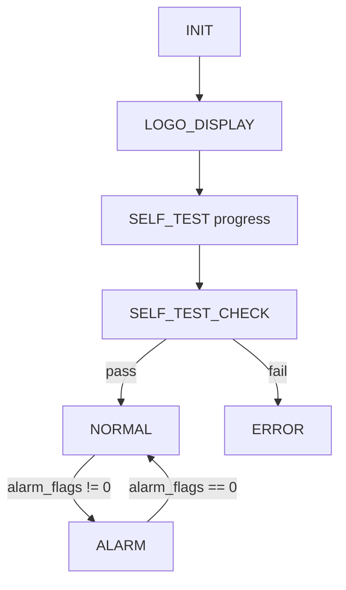
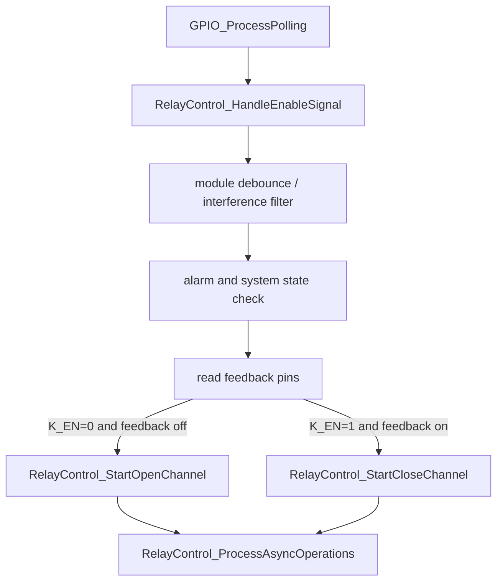

# 当前代码逻辑梳理

日期：2026-06-16

## 项目核心

本项目的核心不是某一个报警点，而是三路高压切换箱控制闭环：

1. 读取外部使能输入 `K1_EN` / `K2_EN` / `K3_EN`。
2. 根据输入和互锁条件驱动三路磁保持继电器。
3. 读取继电器反馈和接触器反馈。
4. 根据反馈、温度、自检、电源等条件生成 A-O 类报警。
5. 根据报警状态控制 OLED、ALARM 输出、蜂鸣器和看门狗策略。

## 当前启动流程

入口位于原始工程 `Core/Src/main.c`。

当前启动顺序大致为：

1. `HAL_Init()`
2. `SystemClock_Config()`
3. CubeMX 外设初始化：
   - GPIO
   - DMA
   - ADC1
   - I2C1
   - IWDG
   - SPI2
   - TIM3
   - USART1
   - USART3
4. 启动风扇 PWM。
5. OLED 连接测试和初始化。
6. 温度监控初始化。
7. 继电器控制初始化。
8. 系统控制初始化。
   - 内部又调用 `SafetyMonitor_Init()`。
   - 开始 LOGO 显示阶段。
9. GPIO 轮询系统初始化。
10. IWDG 控制模块初始化。
11. 复位原因检测。
12. Flash 连接测试。
13. 日志系统初始化。
14. 复位分析初始化。
15. 进入主循环。

问题：

- `main.c` 同时负责启动、复位分析、Flash 测试、按键长按、日志输出，职责过多。
- `MX_IWDG_Init()` 在 CubeMX 初始化阶段已经执行，但后面又有 `IwdgControl_Init()` / `IwdgControl_Start()` 这套封装，实际看门狗生命周期不够清晰。

## 当前主循环

主循环位于原始工程 `Core/Src/main.c`。

高优先级顺序：

1. `GPIO_ProcessPolling()`
2. `SafetyMonitor_ProcessDcCtrlInterrupt()`
3. `SystemControl_Process()`
4. KEY1 / KEY2 长按功能处理
5. 分批日志输出

问题：

- 主循环中混入大量人工调试/维护功能。
- KEY1 / KEY2 的功能逻辑与设备核心控制逻辑耦合在一起。
- `SafetyMonitor_ProcessDcCtrlInterrupt()` 名义上处理中断，但实际中断已禁用，来源是 GPIO 轮询回调。

## 当前系统状态机

状态定义：

- `SYSTEM_STATE_INIT`
- `SYSTEM_STATE_LOGO_DISPLAY`
- `SYSTEM_STATE_SELF_TEST`
- `SYSTEM_STATE_SELF_TEST_CHECK`
- `SYSTEM_STATE_NORMAL`
- `SYSTEM_STATE_ERROR`
- `SYSTEM_STATE_ALARM`

状态流程：



问题：

- 自检失败进入 `ERROR`，但报警 N 类也在安全监控中存在，两者边界不清。
- 正常和报警状态都调用 `SystemControl_MainLoopScheduler()`，但系统是否允许继电器动作又在 `RelayControl_HandleEnableSignal()` 中再次判断。

## 当前周期调度

`SystemControl_MainLoopScheduler()` 当前周期任务：

- 每 5ms：`RelayControl_ProcessAsyncOperations()`
- 每 1ms：再次调用 `RelayControl_ProcessAsyncOperations()`
- 每 1000ms：风扇转速统计
- 每 100ms：温度更新和温度报警处理
- 每 200ms：OLED 更新
- 每 100ms：`SafetyMonitor_Process()`
- 每 500ms：`IwdgControl_SafetyMonitorIntegration()`
- 每 30000ms：异步操作统计输出

问题：

- 继电器异步状态机被 5ms 和 1ms 两个周期重复调用。
- 温度报警既在 `TemperatureMonitor_CheckAndHandleAlarm()` 中处理，又在 `SafetyMonitor_CheckTemperatureAlarm()` 中处理，存在重复判定风险。
- 安全监控、显示、看门狗策略都由 `system_control.c` 调度，但规则分散在多个模块。

## 当前 GPIO 逻辑

`gpio_control.c` 当前职责：

1. 读取输入引脚。
2. 控制输出引脚。
3. 保留旧中断回调。
4. 轮询 K1/K2/K3/DC_CTRL。
5. 对 K_EN 状态变化直接调用继电器控制。
6. 对 DC_CTRL 状态变化直接调用安全监控回调。

问题：

- GPIO 层不是纯硬件抽象层，已经直接参与业务流程。
- 输入消抖和业务动作耦合。
- DC_CTRL 快速路径和安全监控周期路径对异常电平理解不一致。

## 当前继电器控制逻辑

当前继电器模块包含：

1. 三通道状态缓存。
2. 通道互锁检查。
3. K_EN 输入处理。
4. 干扰检测。
5. 异步动作状态机。
6. 阻塞兼容接口。
7. 给安全监控使用的 busy 查询。

K_EN 状态变化链路：



问题：

- `RelayControl_HandleEnableSignal()` 同时负责输入防抖、干扰判断、安全阻止、反馈读取和动作启动。
- 安全监控模块又依赖 `RelayControl_IsChannelBusy()` 来屏蔽报警，形成双向耦合。
- `RelayControl_CheckChannelFeedback()` 标注已废弃但仍保留公开接口。
- 异步接口和阻塞兼容接口并存。

与原始 README 的差异：

- 原始 README 要求继电器 ON/OFF 输出 500ms 低电平脉冲。
- 原始 README 要求脉冲结束后延时 500ms 再检查状态反馈。
- 当前异步状态机参数中存在 100ms 脉冲和 100ms 反馈延时。
- 这个差异不能直接视为优化，重构时必须作为待确认项处理。

## 当前安全监控逻辑

当前职责：

1. A-O 异常标志管理。
2. 异常检测。
3. 异常解除条件。
4. ALARM 输出。
5. 蜂鸣器状态机。
6. 外部电源监控。
7. 启动提示音。

报警分类：

- A：使能冲突。
- B-G：继电器反馈异常。
- H-J：接触器反馈异常。
- K-M：温度异常。
- N：自检异常。
- O：外部电源异常。

问题：

- 安全监控同时拥有“故障判定”和“报警输出执行”。
- 继电器反馈判定依赖 `RelayControl_GetChannelState()`，如果继电器内部状态缓存和硬件反馈已经不一致，可能导致二次判断混乱。
- O 类报警有快速路径和周期路径，且快速路径触发条件可疑。
- 温度异常可能同时由温度模块和安全模块处理。

与原始 README 的差异：

- 原始 README 明确 A-O 共 15 类异常；文档中个别“14种异常”表述应视为历史笔误。
- 2026-06-17 已重新确认报警时序：A、N、O 类属于严重故障，蜂鸣器长鸣；B~J 类属于紧急故障，50ms 循环脉冲；K~M 类属于一般故障，1 秒脉冲。
- O 类异常解除条件应为 `DC_CTRL` 恢复低电平。

## 当前外部 DC24V 检测逻辑

硬件/固件关系：

- EasyEDA 信号：`DC_LOCK`
- MCU 引脚：`PB5`
- 固件名称：`DC_CTRL`

路径一：GPIO 轮询快速路径

```text
GPIO_ProcessPolling()
  -> DC_CTRL stable state changed
  -> if stable_state == 0
  -> SafetyMonitor_PowerFailureCallback()
  -> g_dc_ctrl_interrupt_flag = 1
  -> SafetyMonitor_ProcessDcCtrlInterrupt()
  -> read GPIO_ReadDC_CTRL()
  -> if dc_ctrl_state == 1 set ALARM_FLAG_O
```

路径二：安全监控周期路径

```text
SystemControl_MainLoopScheduler()
  -> SafetyMonitor_Process()
  -> SafetyMonitor_UpdateAllAlarmStatus()
  -> SafetyMonitor_CheckPowerMonitor()
  -> read GPIO_ReadDC_CTRL()
  -> if dc_ctrl_state == 1 set ALARM_FLAG_O
```

明确问题：

- 快速路径在 `stable_state == 0` 时触发。
- 真正判定 O 类异常时使用 `dc_ctrl_state == 1`。
- 因此快速路径和周期路径的电平语义不一致。
- 原始 README 明确 `DC_CTRL = 0` 为 DC24V 正常，`DC_CTRL = 1` 为 DC24V 丢失，因此快速路径更明显偏离原始需求。

## 当前看门狗逻辑

当前问题：

- `IwdgControl_SafetyMonitorIntegration()` 在任意报警存在时暂停自动喂狗。
- `IwdgControl_IsSystemSafeToFeed()` 又允许非温度类报警继续喂狗。
- `SmartDelayWithForceFeed()` 可以在延时中强制喂狗。
- `DEBUG_Printf()` 曾因看门狗问题被直接禁用。
- 原始 README 中描述的看门狗策略是 3 秒超时、500ms 喂狗间隔、自检阶段暂停喂狗、错误状态和 K-M 温度异常停止喂狗。
- 当前代码中出现 7 秒参数和不同喂狗策略，必须列为待确认差异。

## 当前自检逻辑差异

原始 README 中自检需求存在两套历史描述：

- 一套是智能状态识别：根据 K1_EN/K2_EN/K3_EN 判断期望通道，再做继电器纠错、接触器检查和温度检测。
- 另一套是开发需求中的安全关断自检：先确认所有通道关断，再要求 K_EN 全高、9 路反馈全低、温度小于 60℃。

当前代码更接近智能状态识别版本。

重构时不能直接把当前代码视为最终需求，必须先确认最终自检策略。

## 当前主要架构问题

1. 模块依赖不是单向的。
2. 一个事实在多个地方重复判定。
3. GPIO 层直接触发业务动作。
4. 安全监控层同时负责判定和输出。
5. 主循环中混入大量维护/测试功能。
6. 看门狗策略存在两套说法。
7. 调试输出是硬禁用，不是配置禁用。
8. 旧接口、废弃接口和新异步接口并存。
